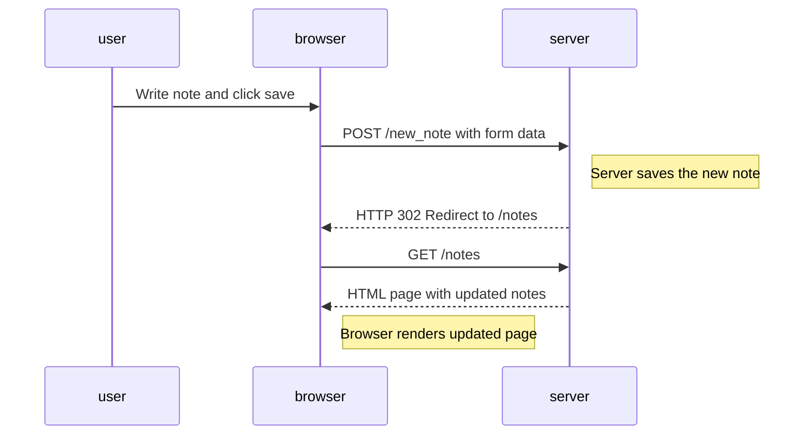

```mermaid

sequenceDiagram
    participant user
    participant browser
    participant server

    user->>browser: Write note and click save
    browser->>server: POST /new_note with form data

    note right of server: Server saves the new note
    server-->>browser: HTTP 302 Redirect to /notes

    browser->>server: GET /notes
    server-->>browser: HTML page with updated notes

    note right of browser: Browser renders updated page
```
