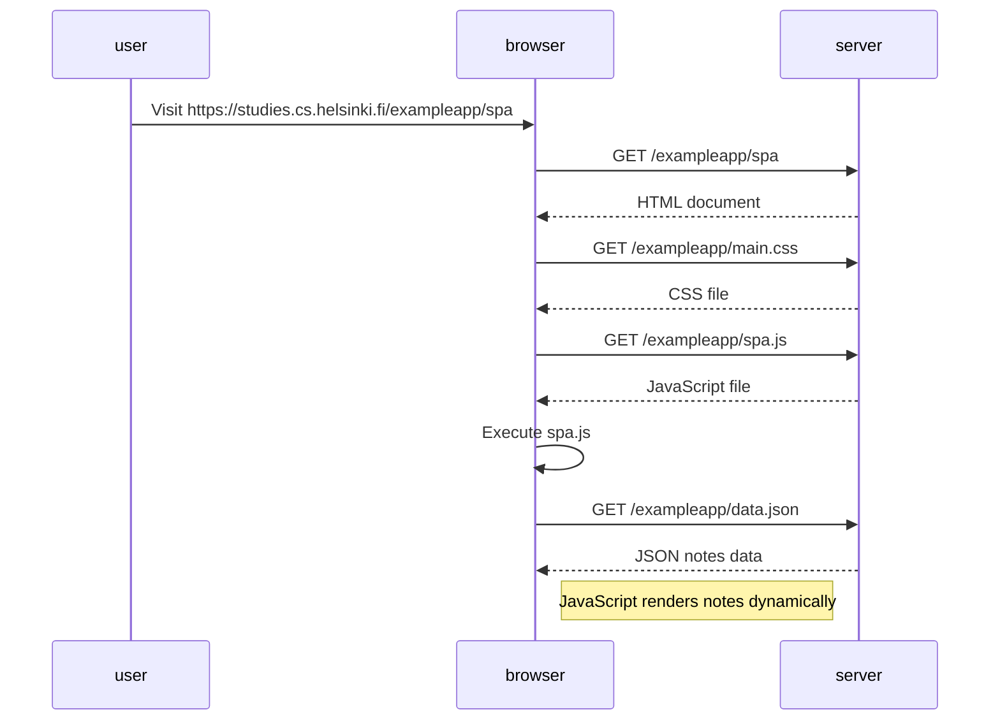

```mermaid

sequenceDiagram
    participant user
    participant browser
    participant server

    user->>browser: Visit https://studies.cs.helsinki.fi/exampleapp/spa

    browser->>server: GET /exampleapp/spa
    server-->>browser: HTML document

    browser->>server: GET /exampleapp/main.css
    server-->>browser: CSS file

    browser->>server: GET /exampleapp/spa.js
    server-->>browser: JavaScript file

    browser->>browser: Execute spa.js

    browser->>server: GET /exampleapp/data.json
    server-->>browser: JSON notes data

    note right of browser: JavaScript renders notes dynamically

```
