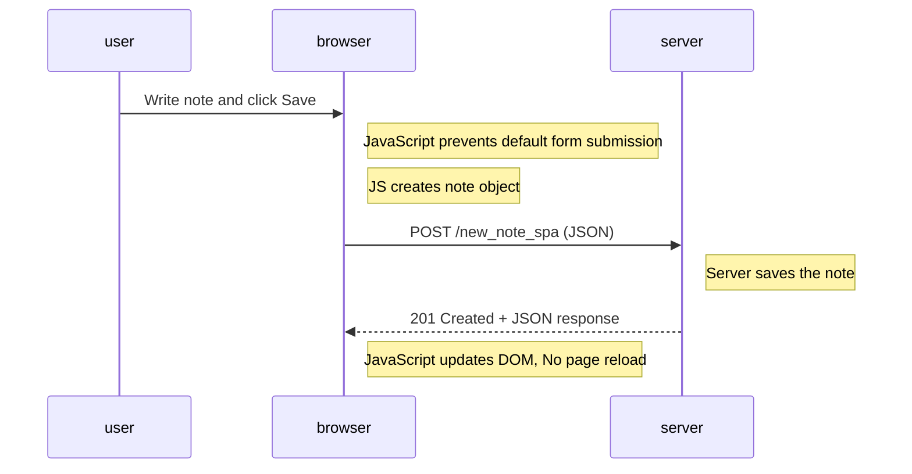

```mermaid

sequenceDiagram
    participant user
    participant browser
    participant server

    user->>browser: Write note and click Save

    note right of browser: JavaScript prevents default form submission
    note right of browser: JS creates note object

    browser->>server: POST /new_note_spa (JSON)

    note right of server: Server saves the note
    server-->>browser: 201 Created + JSON response

    note right of browser: JavaScript updates DOM, No page reload

```
